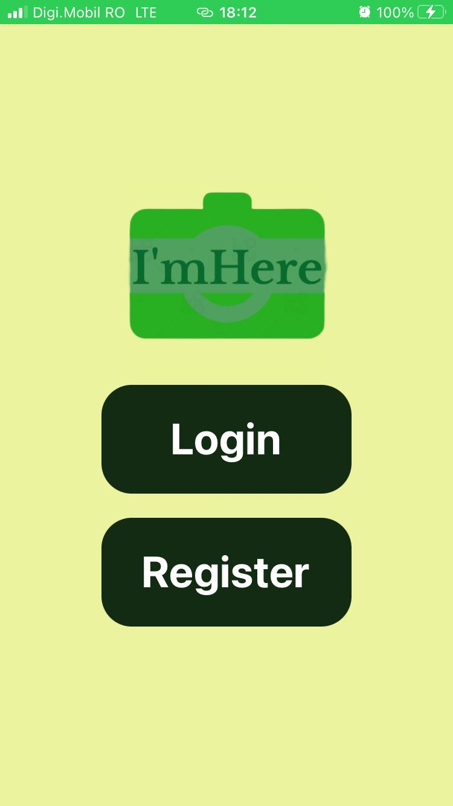
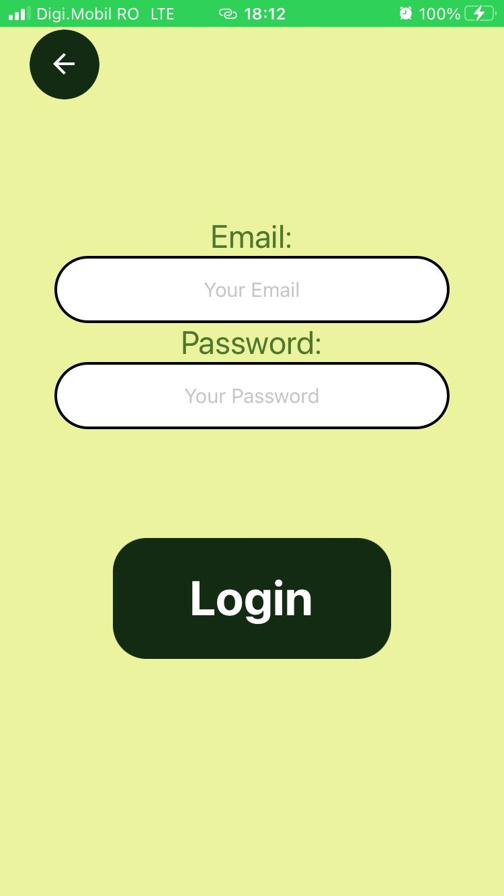
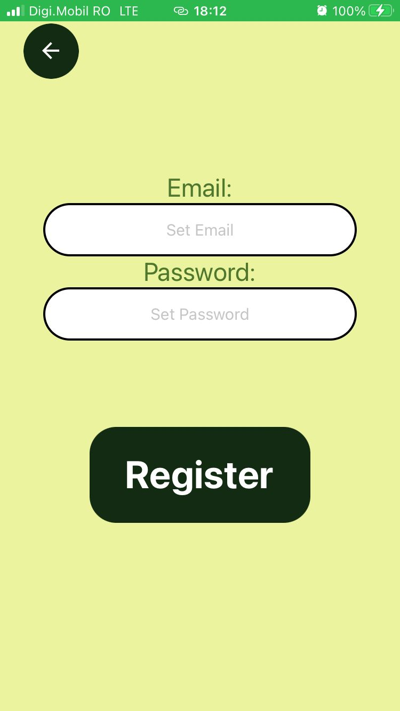
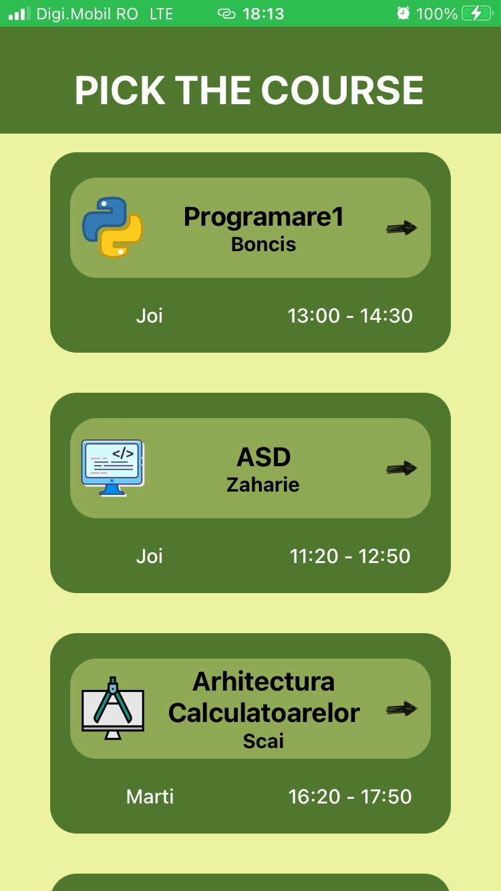
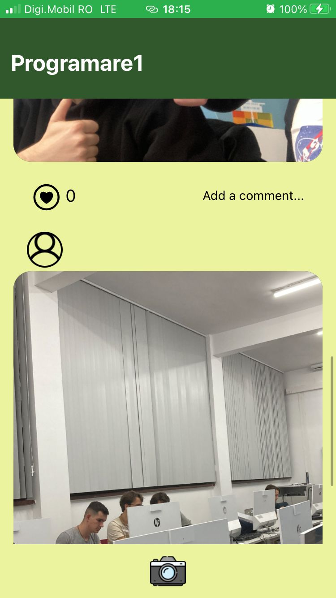
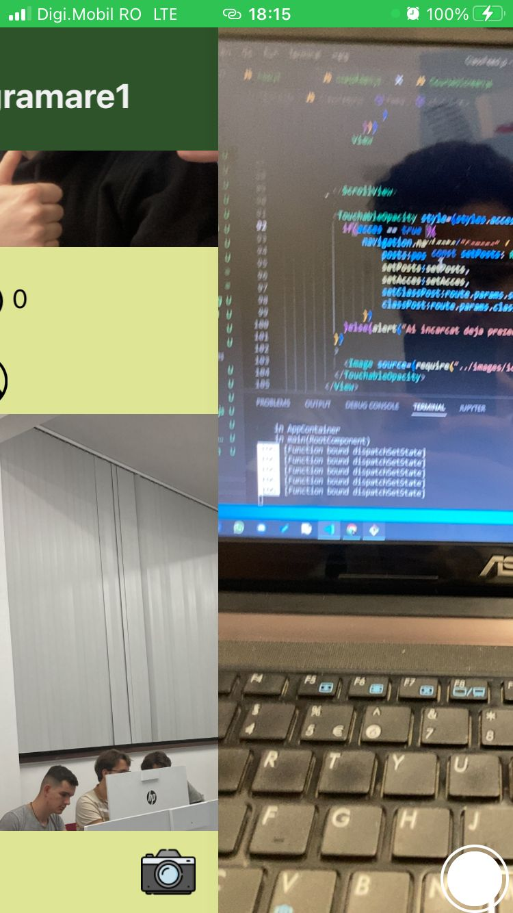
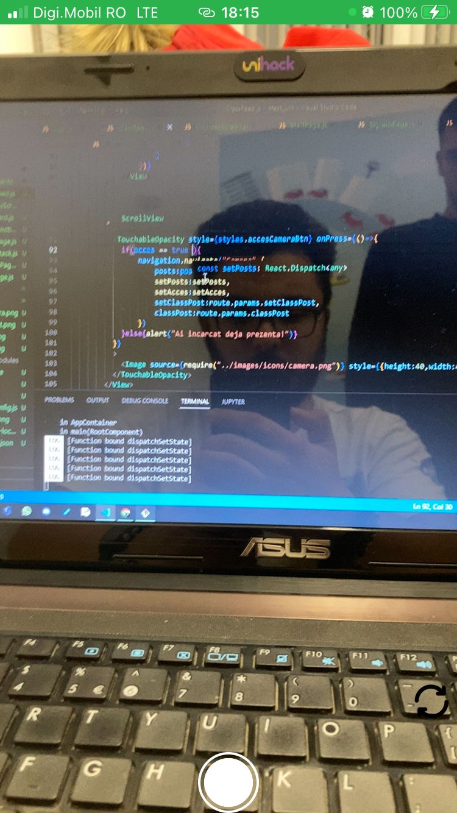

# I'm here

---
Because making sure that everyone at the course is there is hard we brought you "I'm here". A React Native application that combines social fun with the attendace list.

---

The user is welcomed with a strat page, where he can choose to Login or Register:

Than the user input:

  
  

After that the student is sent to the courses on that day:

And every link has the attendace list under the form of a social app:

The student can take his photo:

  
  

---
Team:
1.Pop Iulian
2.Bițică Sebastian
3.Todea Tudor
4.Poenaru Iulian

---
*This is a beta version made in a hackaton(10h), more things coming soon*
